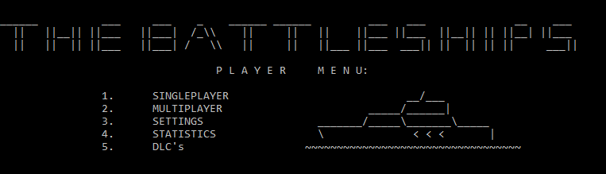

<html>
    <head>
        <meta http-equiv="Content-Type" content="text/html;charset=UTF-16">
    <link rel="stylesheet" href="style.css">
    </head>
    <body>
        

            <h1>自分たちのプロジェクト</h1>
            
"<i>Narzędzia Informatyczne</i>"の科目のために、「海戦ゲーム」に基づくゲームをチームとして作りました。自分たちはこの学期にプログラミング科目にＣ言語を勉強しているから、そのゲームはその言語で書かれています。プロジェクトは終らせませんでしたが、チームワーク技術を高める機会がたくさんあって全て利用しました。

            

                
            
 
            
上の写真に、自分たちのチームで作った「海戦ゲーム」のメニュー

            

            <h1>自分たちのチーム</h1>
            
⋆ <a href="https://asgardianvoyager.github.io/">Arkadiusz Paterak</a> 
            ⋆ <a href="https://dominikbreksa.github.io/">Dominik Breksa</a> 
            ⋆ <a href="https://dulmicha.github.io/">Michał Dul</a> 
            ⋆ <a href="https://caiiguia.github.io/">Szymon Jurecki</a> 
            ⋆ Szymon Zabawa - Częściowe uczestnictwo w projekcie - Brak strony
            

            

            <h1>自分のウェブサイト</h1>
            
それは自分につくウェブサイト。私は十九歳ですけど、とても幼く感じています。
             
            色々な興味があります。日本語を勉強したり、けん玉をやったり、日本の八十年代のを聞いたり、
            様々な自動車を調べたりします。日本語と言えば、今までで八年間で自習して、今年日本語能力試験N2を合格しました。
            それは私の三つ目の試験でありました。過去にもうN5（一番優しい）とN3のレベルで合格しました。
            そのN2試験の証明書で、日本に合法に仕事を就くことができます。
            

            

                
            

            

            上の写真に、私のけん玉が見えています。それは、江戸の日本から来たおもちゃですけど、現在にまだ本当に面白いです。
             
            それはさておき、上記に日本の八十年代の音楽について書きました。そういえば、
            <a href="https://www.youtube.com/watch?v=Vxis_H3yNOc&ab_channel=OMEGATRIBE-Topic">こちらへ</a>
            私の一番大好きな歌です。
             
            楽しんでください！( ^)o(^ )
            

        

    </body>
</html>